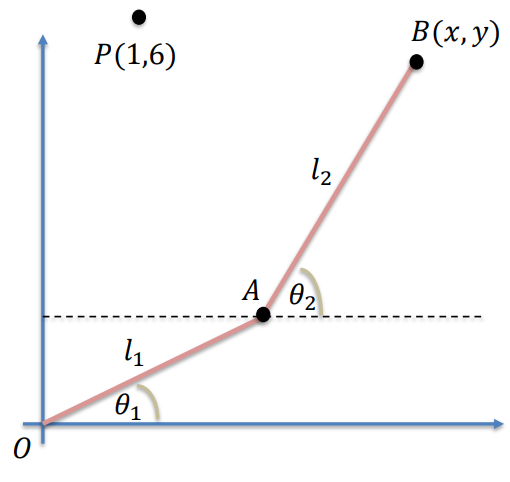

# Non Linear Systems

## What's included?

### 1_FixedPointIterationMethod.c: Fixed-Point Iteration Method for Solving Nonlinear Equations

The system of nonlinear equations to be solved is:

$$ x_1^2 - 10x_1 + x_2^2 + 8 = 0 $$
$$ x_1 x_2^2 + x_1 - 10x_2 + 8 = 0 $$

The goal is to find the values of $x_1$ and $x_2$ that satisfy both equations simultaneously.
The initial guess is $x^{(0)} = [0.1,0.1]^T$

 
# Robotic Arm Kinematics

## 2_NewtonRaphson_RoboticArm.c: Newton Method

A robotic arm moves in the $xOy$ plane, anchored at the origin of the coordinate system. It consists of two rigid rods connected at a joint $A$. The position of the free end $B(x, y)$ of the arm is determined by the lengths of the rods $l_1 = 2$ and $l_2 = 5$, and the angles $\theta_1$ and $\theta_2$.

Given the lengths of the rods $l_1 = 2$ and $l_2 = 5$, and the desired position of the free end $B$ at $(1, 6)$, we need to find the values of angles $\theta_1$ and $\theta_2$ such that the robotic arm positions its free end accurately.

## Solution Approach

To solve this problem, we use the laws of robotic arm kinematics, specifically the equations derived from the cosine rule and trigonometric relationships:

    

$$ x_A = l_1\cos(\theta_1) = 2\cos(\theta_1) $$
$$ y_A = l_1\sin(\theta_1) = 2\sin(\theta_1) $$

Point B has coordinates:

$$ x = l1\cos(\theta_1) + l2\cos(\theta_2) = 2\cos(theta_1) + 5\cos(\theta_2) $$
$$ y = l1\sin(\theta_1) + l2\sin(\theta_2) = 2\sin(theta_1) + 5\sin(\theta_2) $$

 
